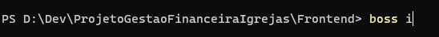

# Projeto Gestão Financeira Igrejas

Projeto desenvolvido como solução para auxiliar na gestão financeira de igrejas.

Os executáveis são separados nos seguintes diretórios:  
 
Cliente:

- [ProjetoGestaoFinanceiraIgrejas/Frontend/](https://github.com/EduardoSilvaFeitosa/ProjetoGestaoFinanceiraIgrejas/tree/main/Frontend)

Sevidores:

- [ProjetoGestaoFinanceiraIgrejas/Backend/](https://github.com/EduardoSilvaFeitosa/ProjetoGestaoFinanceiraIgrejas/tree/main/Backend)

Sendo que os servidores são divididos em:

- Servidor de Relatórios: [ProjetoGestaoFinanceiraIgrejas/Backend/](https://github.com/EduardoSilvaFeitosa/ProjetoGestaoFinanceiraIgrejas/tree/main/Backend/Reports) ; e
- Servidor de Regras de Negócio: [ProjetoGestaoFinanceiraIgrejas/Backend/](https://github.com/EduardoSilvaFeitosa/ProjetoGestaoFinanceiraIgrejas/tree/main/Backend/Business)

Para compilar o projeto é necessário que as dependências do projeto sejam adicionadas. No desenvolvimento do projeto foi utilizado o BOSS como gerenciador de dependências. Entretanto, as dependências podem ser baixadas e adicionadas manualmente ao projeto.
 

### Instalação das dependências utilizando o Boss

- Acessar o diretório do projeto que deseja baixar as dependências;
- Abrir o diretório no terminal e digitar o comando “boss i”;
    Ex.:  
  
- Após isso, é necessário aguardar o download das dependências.

### Configuração da base de dados

Os comamdos para criar os objetos do banco de dados estão disponíveis no diretório raiz do projeto, no arquivo com o nome "[comandos-criar-base-dados.sql](https://github.com/EduardoSilvaFeitosa/ProjetoGestaoFinanceiraIgrejas/blob/main/comandos-criar-base-dados.sql)". É importante observar que o SGBD utilizado no projeto doi o PostgreSQL. 
Para alterar os dados da conexão com a base de dados basta ir até o arquivo "[Provider.Connection.pas](https://github.com/EduardoSilvaFeitosa/ProjetoGestaoFinanceiraIgrejas/blob/main/Backend/Common/providers/Provider.Connection.pas)" encontrado através do caminho [ProjetoGestaoFinanceiraIgrejas/Backend/Common/providers](https://github.com/EduardoSilvaFeitosa/ProjetoGestaoFinanceiraIgrejas/tree/main/Backend/Common/providers)
